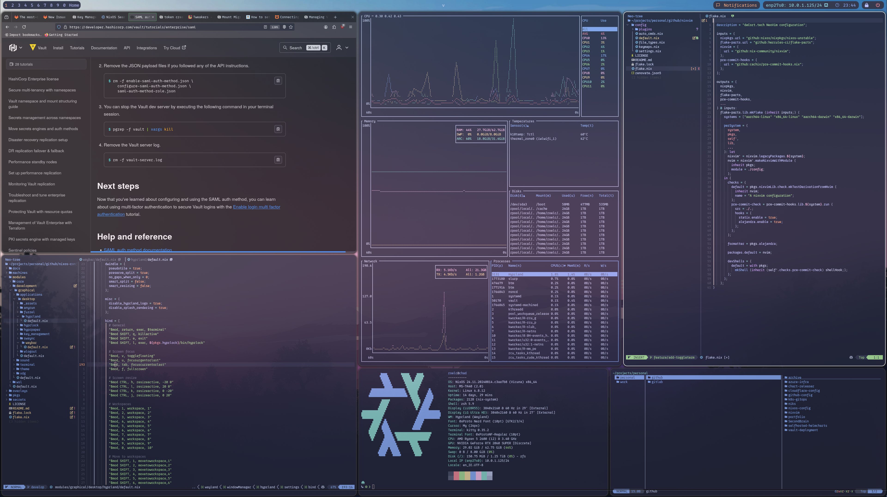

<h1 align="center">Welcome to my NixOS Configuration Repository</h1>

    
    

    This is my NixOS configuration, the goal is to create fully reproducable operating systems based on the Nix package manager, home-manager and flakes.
    My main use case is cloud automation and development, with this configuration I want to create a fully streamlined workflow fully catered to my needs in a declarative fasion.

    

## Highlights

- ZFS with impermanence (blank snapshot at boot)
- SOPS Nix for secret management
- Custom [NixVim](https://github.com/dc-tec/nixvim) flake
- Hyprland as tiling window manager
- Catppuccin themed

## Configuration

The repository is setup in a modular fasion. The configuration can be split into the following main components:

- Machines
  - Contains the per device hardware configuration and host settings.
- Core
  - The core module contains applications and configuration settings that will be applied on all systems.
- Development
  - The development module contains the different development tools I need on a day to day basis. The submodules all contain options to either enable or disable certain tools. By default they are all enabled
- Graphical
  - The graphical module contains different submodules related to my desktop enviroment based on Hyprland and other required applications and configurations that are needed for a smooth experience.
- Overlays
  - If needed we can apply an overlay over certain packages. These overlays are defined here.
- Pkgs - The pkgs directory contains custom packages.
- Secrets - Encrypted secrets using Nix SOPS.

### ZFS

ZFS is used on the storage layer. I'm making use of impermanence where the filesystem is reset to a blank state on each reboot. For first time use, see the README's in the machines direc

### SOPS

For secret management in a pure Nix way Nix SOPS is used. See [add new host](docs/add-new-host.md)

### WSL

I want to be able to use my configuration when working on a Windows machine (i.e. my work laptop). I make use of [NixOS-WSL](https://github.com/nix-community/NixOS-WSL). Because the main configuration uses impermanence and ZFS and this is ofcourse not supported in WSL I created options throughout the config to enable / disable impermanence. Also the graphical module is not loaded. See the [flake](flake.nix).

### References

- [Erase Your Darlings](https://grahamc.com/blog/erase-your-darlings/)
- [Anton Hakansson](https://github.com/AntonHpackage overlay nixpkgakansson/nixos-config/)

#### Disclaimer

Feel free to use this repository as a reference for your own configuration. However do not expect to be able to run this configuration on your own system as-is. If you have a question feel free to create an issue.
