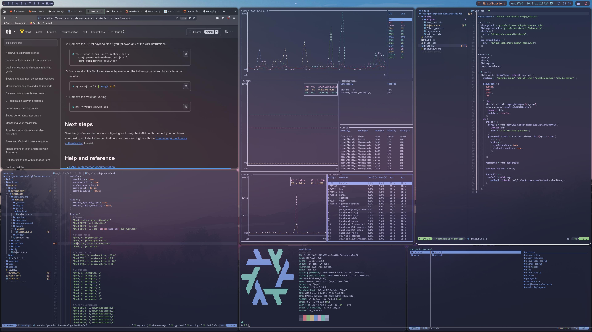

# NixOS and nix-darwin configuration

This repository contains the declarative configuration for the systems I
actively manage: NixOS workstations, a WSL development environment, a macOS
workstation and a dedicated engineering server.

The workstation configurations share development tools and user-level defaults
where that is useful. The Forge server follows a separate, smaller composition
path so public infrastructure does not inherit desktop settings, personal
secrets or workstation state.

## Systems

| Host     | Platform              | Purpose                                                                             |
| -------- | --------------------- | ----------------------------------------------------------------------------------- |
| `chad`   | NixOS, x86-64         | Desktop workstation with encrypted ZFS, impermanence and virtualization             |
| `legion` | NixOS, x86-64         | Laptop with encrypted ZFS, impermanence and wireless networking                     |
| `ghost`  | NixOS on WSL2, x86-64 | Lightweight Windows development environment                                         |
| `darwin` | macOS, Apple Silicon  | Daily workstation managed with nix-darwin, Home Manager and Homebrew                |
| `forge`  | NixOS, x86-64         | Engineering server for forge services, monitoring, backups and the native Nix cache |

Forge is not a general-purpose homelab or a platform for customer data. Its
architecture and operating procedures are documented in the
[Forge guide](./docs/machine-forge.md).

## Screenshots

### NixOS



### macOS


## Configuration structure

The flake composes each host from platform modules and a machine-specific
definition:

```text
chad, legion, ghost = shared modules + NixOS modules + machine definition
darwin               = shared modules + Darwin modules + machine definition
forge                = stable NixOS + Disko + server modules + machine definition
```

- `machines/` contains host identity, hardware and host-specific settings.
- `modules/shared/` contains the Home Manager environment and configuration
  shared by workstation-class NixOS and Darwin systems.
- `modules/nixos/` contains Linux desktop, storage, connectivity,
  virtualization and server modules.
- `modules/nixos/server/` contains the reusable server baseline and the Forge
  service composition.
- `modules/darwin/` contains macOS system, desktop and Homebrew configuration.
- `lib/` contains helper functions used by the module system.
- `overlays/` defines local packages, selected stable packages and a small set
  of packages taken from the current Nixpkgs master branch.
- `pkgs/` contains local packages and Forge operator commands.
- `secrets/` contains SOPS-encrypted workstation secrets; `public-keys.nix`
  contains public identity material that is safe to commit.

The workstation configurations use NixOS unstable as their primary package
set. Forge uses the stable NixOS package set and does not inherit the shared
workstation modules. This separation is explicit in `flake.nix`.

## Included configuration

- encrypted ZFS roots and ephemeral system state on `chad` and `legion`;
- Home Manager configuration shared across Linux and macOS workstations;
- a separate NixVim flake for the editor configuration;
- Hyprland on graphical NixOS hosts and declarative macOS desktop settings;
- SOPS with age-backed secret decryption for workstation configuration;
- WireGuard-only administration, Restic backups, Prometheus, Alertmanager and
  Grafana on Forge;
- a signed, read-only native Nix binary cache for managed systems; and
- repository-local packages for repeatable Forge provisioning and cache
  publication.

## Working with the repository

Enter the development shell and run the repository checks with:

```console
nix develop
nix fmt
pre-commit run --all-files
```

Inspect the available packages, checks and host outputs with:

```console
nix flake show
```

On an already configured host, `nh` uses this repository as its default flake:

```console
# NixOS workstation
nh os switch --hostname chad

# macOS workstation
nh darwin switch --hostname darwin
```

Equivalent direct commands are:

```console
# NixOS workstation
doas nixos-rebuild switch --flake .#chad

# macOS workstation
darwin-rebuild switch --flake .#darwin
```

Forge is built remotely from the Apple Silicon workstation and follows a
test-before-switch workflow. See the
[Forge build and deployment procedure](./docs/machine-forge.md#build-and-deployment)
instead of applying the workstation commands to that host.

## Secrets and cache boundaries

SOPS-encrypted files support the personal workstation configurations. Forge
does not receive that material. Its small set of bootstrap secrets is resolved
from the operator workstation with SecretSpec and provisioned over WireGuard;
private values are not stored in the repository or the Nix store.

Managed systems trust the public Forge cache key in `public-keys.nix` and
can read from `https://cache.decort.tech`. Publishing requires WireGuard SSH
access and a root-only command on Forge. GitHub Actions continues to use
Cachix and does not receive Forge cache publication authority.

## Documentation

The `docs/` directory contains host guides, module explanations, maintenance
procedures and troubleshooting notes. NDG combines those files with generated
module-option documentation:

```console
nix build .#docs
```

Documentation changes merged to `main` are built and deployed to GitHub Pages.

## Continuous integration

GitHub Actions runs formatting and static checks, builds every NixOS host, and
builds the Apple Silicon nix-darwin configuration on a macOS runner. Forge also
has dedicated checks for its Disko layout and Prometheus alert rules. Successful
pushes to `main` may publish build results to Cachix; pull requests are
read-only cache consumers.

## Reuse

This is a personal configuration rather than a general-purpose NixOS
distribution. The module structure and individual snippets may be useful
elsewhere, but hardware identifiers, usernames, network addresses and secret
recipients need to be adapted before reuse.

Related references:

- [Erase Your Darlings](https://grahamc.com/blog/erase-your-darlings/)
- [NixOS Impermanence](https://github.com/nix-community/impermanence)
- [nix-darwin](https://github.com/LnL7/nix-darwin)

The desktop wallpapers are from
[orxngc/walls-catppuccin-mocha](https://github.com/orxngc/walls-catppuccin-mocha).
